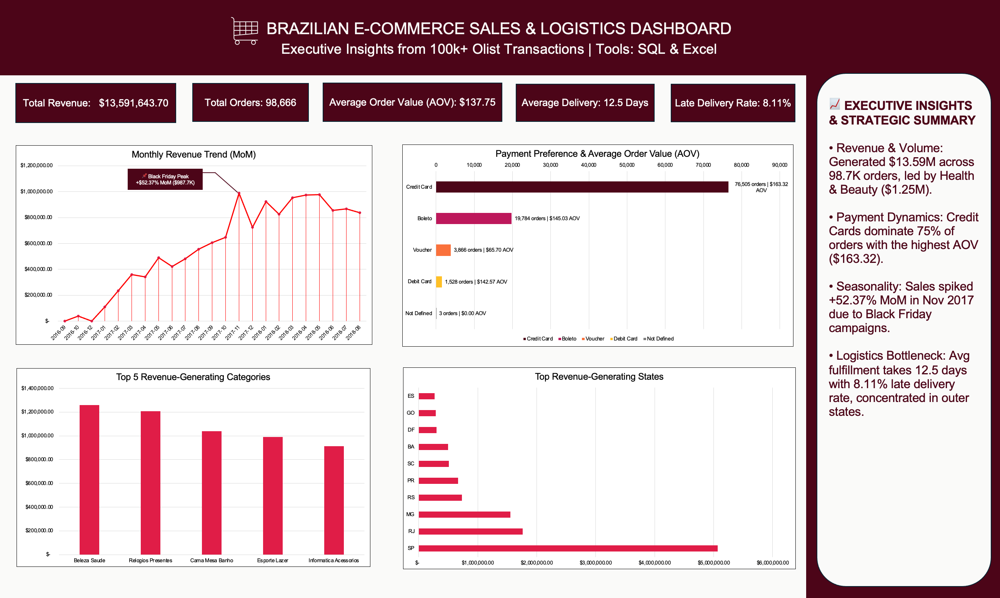

# 🛒 Brazilian E-Commerce Sales Analytics (SQL + Excel)
> **An end-to-end data analytics project leveraging DuckDB SQL for complex data extraction & transformation, and Microsoft Excel for executive dashboard visualization.**

## 📌 Executive Summary
This project analyzes **100,000+ real-world e-commerce orders** from the Olist marketplace dataset in Brazil using DuckDB SQL and Excel visualizations. The objective is to identify revenue drivers, fulfillment bottlenecks, and customer payment trends.

---

## 🏗️ Project Architecture & Data Pipeline

```text
┌───────────────┐     ┌───────────────┐     ┌───────────────┐     ┌────────────────┐     ┌─────────────────┐
│    Raw CSV    │ ──> │    DuckDB     │ ──> │  SQL Queries  │ ──> │ Excel Visuals  │ ──> │    Business     │
│  (100k+ Rows) │     │ (SQL Engine)  │     │ (CTEs & LAG)  │     │  & Dashboard   │     │ Recommendations │
└───────────────┘     └───────────────┘     └───────────────┘     └────────────────┘     └─────────────────┘
```

---

## 📊 Executive Dashboard Preview


*Figure 1: Executive Excel Dashboard summarizing key SQL query outputs.*

---

## 🔍 Key Insights & Business Questions

### 1. Total Revenue & Order Volume
* **Key Insight:** Olist generated **$13.59M+ in total revenue** across **98,666 unique delivered orders**, indicating a strong marketplace foundation.

<details>
<summary>🔍 <b>View SQL Query</b></summary>

```sql
SELECT 
    COUNT(DISTINCT order_id) AS total_orders,
    ROUND(SUM(price), 2) AS total_revenue
FROM '/kaggle/input/datasets/organizations/olistbr/brazilian-ecommerce/olist_order_items_dataset.csv';
```
</details>

---

### 2. Top Revenue-Generating Product Categories

* **Key Insight:** **Health & Beauty** ($1.25M) and **Watches & Gifts** ($1.20M) are the top revenue drivers. High-end lifestyle categories consistently outperform everyday goods in sales value.

<details>
<summary>🔍 <b>View SQL Query</b></summary>

```sql
SELECT 
    p.product_category_name AS category_name,
    ROUND(SUM(i.price), 2) AS total_revenue
FROM '/kaggle/input/datasets/organizations/olistbr/brazilian-ecommerce/olist_order_items_dataset.csv' i
JOIN '/kaggle/input/datasets/organizations/olistbr/brazilian-ecommerce/olist_products_dataset.csv' p 
  ON i.product_id = p.product_id
WHERE p.product_category_name IS NOT NULL
GROUP BY category_name
ORDER BY total_revenue DESC
LIMIT 5;
```
</details>

---

### 3. Payment Preferences & Average Order Value (AOV)

* **Key Insight:** **Credit Card transactions account for 75% of orders**, yielding the highest Average Order Value (**$163.32**). Voucher users purchase frequently but spend significantly less per order ($65.70 AOV).

<details>
<summary>🔍 <b>View SQL Query</b></summary>

```sql
SELECT 
    payment_type,
    COUNT(DISTINCT order_id) AS total_orders,
    ROUND(AVG(payment_value), 2) AS avg_order_value
FROM '/kaggle/input/datasets/organizations/olistbr/brazilian-ecommerce/olist_order_payments_dataset.csv'
GROUP BY payment_type
ORDER BY total_orders DESC;
```
</details>

---

### 4. Month-over-Month (MoM) Revenue Growth

* **Key Insight:** Following initial launch phases in late 2016, sales grew steadily throughout 2017–2018, peaking exponentially during **Black Friday promotions in November 2017 ($987.7K revenue, +52.37% MoM)**.

<details>
<summary>🔍 <b>View SQL Query</b></summary>

```sql
WITH monthly_sales AS (
    SELECT 
        DATE_TRUNC('month', CAST(o.order_purchase_timestamp AS TIMESTAMP)) AS month,
        ROUND(SUM(i.price), 2) AS total_revenue
    FROM '/kaggle/input/datasets/organizations/olistbr/brazilian-ecommerce/olist_orders_dataset.csv' o
    JOIN '/kaggle/input/datasets/organizations/olistbr/brazilian-ecommerce/olist_order_items_dataset.csv' i 
      ON o.order_id = i.order_id
    WHERE o.order_status = 'delivered'
    GROUP BY month
)
SELECT 
    STRFTIME(month, '%Y-%m') AS sales_month,
    total_revenue,
    LAG(total_revenue) OVER (ORDER BY month) AS prev_month_revenue,
    ROUND(((total_revenue - LAG(total_revenue) OVER (ORDER BY month)) / LAG(total_revenue) OVER (ORDER BY month)) * 100, 2) AS mom_growth_pct
FROM monthly_sales
ORDER BY month;
```
</details>

---

### 5. Delivery Performance & Logistics Delays

* **Key Insight:** Average fulfillment takes **12.5 days**, with **8.11% of orders delivered past estimated dates**. Late shipments are heavily concentrated in specific regional logistics hubs.

<details>
<summary>🔍 <b>View SQL Query</b></summary>

```sql
SELECT 
    ROUND(AVG(DATE_DIFF('day', CAST(order_purchase_timestamp AS TIMESTAMP), CAST(order_delivered_customer_date AS TIMESTAMP))), 1) AS avg_delivery_days,
    ROUND(COUNT(CASE WHEN CAST(order_delivered_customer_date AS TIMESTAMP) > CAST(order_estimated_delivery_date AS TIMESTAMP) THEN 1 END) * 100.0 / COUNT(order_id), 2) AS late_delivery_percentage
FROM '/kaggle/input/datasets/organizations/olistbr/brazilian-ecommerce/olist_orders_dataset.csv'
WHERE order_status = 'delivered';
```
</details>

---

## 💡 Strategic Recommendations
1. **Regional Fulfillment Hubs:** Establish local hubs in high-delay regions to reduce the **8.11% late delivery rate** and improve overall fulfillment cycles below the 12.5-day benchmark.
2. **Promote Credit Installments:** Partner with financial institutions for zero-interest installments on high-AOV categories (*Watches & Gifts*, *Health & Beauty*) to sustain transaction volume.
3. **Targeted Cross-Selling:** Bundle lower-AOV voucher purchases with trending high-value products to boost average shopping cart sizes.

---

## 🚀 How to Run This Project
1. **Clone the Repository:**
   ```bash
   git clone [https://github.com/hanamaisrh/Brazilian-Ecommerce-Sales-Analytics-SQL.git](https://github.com/hanamaisrh/Brazilian-Ecommerce-Sales-Analytics-SQL.git)
   ```
2. **Execute SQL Analysis:**
   * Open `brazilian_ecommerce_sql.ipynb` in Kaggle Notebooks, OR
   * Load the [Olist E-Commerce Dataset](https://www.kaggle.com/datasets/olistbr/brazilian-ecommerce) into DuckDB/Kaggle and execute the queries from `queries.sql`.
3. **View Dashboard:**
   * Open `Brazilian_Ecommerce_Dashboard.xlsx` in Microsoft Excel to view formatted KPI cards and charts, or view `dashboard-preview.png`.
  
---

## 📁 Repository Structure
```text
├── Brazilian_Ecommerce_Dashboard.xlsx              # Formatted Excel Dashboard & Charts
├── brazilian-ecommerce-sales-analytics-sql.ipynb   # Interactive Kaggle Notebook execution
├── queries.sql                                     # Full standalone SQL script
├── dashboard-preview.png                           # High-resolution dashboard screenshot
└── README.md                                       # Executive Project Documentation
```

---

## 👩‍💻 Author & Contact
**Hana Maisarah**  
*Data Analyst Portfolio Project*  
* **LinkedIn:** https://www.linkedin.com/in/hana-maisarah-309a33294/
* **Email:** hanamaisarah2004@gmail.com

---
*If you find this project insightful, feel free to give it a ⭐️ star!*
